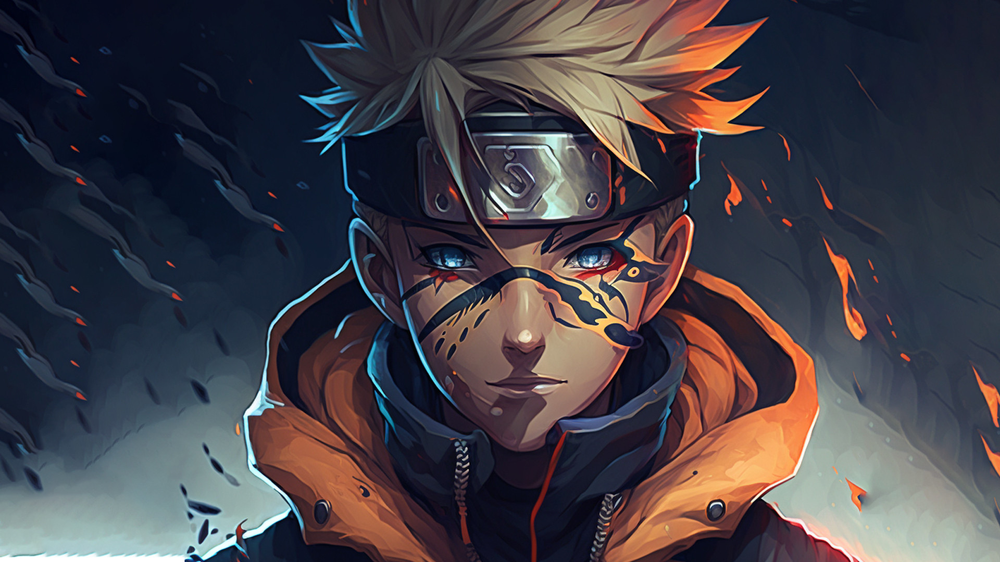

# Generative AI Projects

Follow me on Linkedin: \
Follow me on X: 

| Sr. No. | Name of the Project      | Link                                      |
| ------- | ----------------------- | ----------------------------------------- |
| 1       | Fine Tune Local Models With LORA     | [GitHub Repo](https://github.com/Ajith-Kumar-Nelliparthi/Fine-Tuning-Local-Models_With-LORA.git) |
| 2       | Fine Tune Local Models Using Unsloth     | [GitHub Repo](https://github.com/Ajith-Kumar-Nelliparthi/Unsloth-FineTuning.git) |
| 3       | Fine Tune Phi-2 model on custom dataset     | [GitHub Repo](https://github.com/Ajith-Kumar-Nelliparthi/Phi-2-FineTuning.git) |
| 4       | Train a Small Language Model for Disease Symptoms using Unsloth     | [GitHub Repo](https://github.com/Ajith-Kumar-Nelliparthi/Train-a-Small-Language-Model-for-Disease-Symptoms-using-Unsloth.git) |

<!-- Add more projects below as you complete them -->